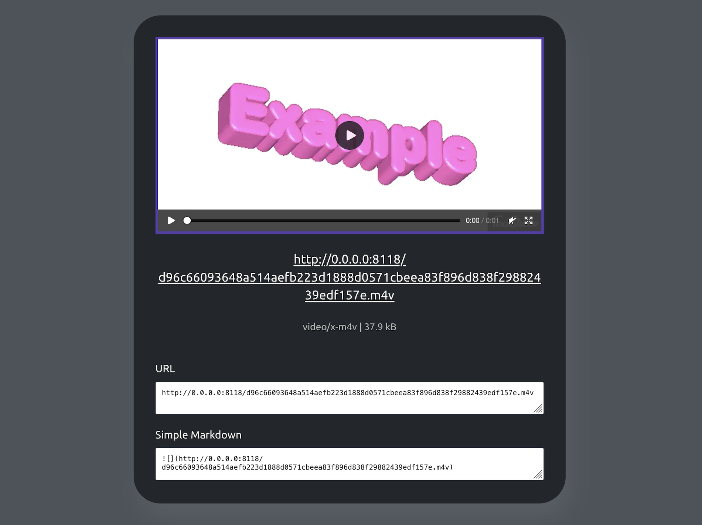

<div align="center">
  <br>
  
  <h1>PEPIC</h1>
</div>

Pepic is a small self-hosted media proxy that helps me to upload, store, serve and convert pictures and videos on my own servers.

Currently, I use it as a main storage for media files in my [pet-projects](https://github.com/vas3k/vas3k.club) and on [my blog](https://vas3k.blog).

Pepic can upload and optimize media files in-flight to save you money and bandwidth. It's highly recommended to set ip up in combination with Cloudflare CDN for better caching.

Internally it uses [ffmpeg](https://ffmpeg.org/download.html) for videos and [vips](https://libvips.github.io/libvips/install.html) for images, which makes it quite fast and supports many media file formats.

Images: **JPG, PNG, GIF, WEBP, SVG, HEIF, TIFF, AVIF, etc**

Video: **basically everything ffmpeg supports**

Pepic is open source, however it's not meant to be used by anyone. Only if you're brave (like me). Scroll down this README for better alternatives.


## Features

- **Local file storage**: Upload files as multipart/form-data or as a simple byte stream and store them to a local directory.
- **Automatic GIF to video conversion**: Convert GIFs to videos because GIFs suck, slow down web pages, and don't support hardware acceleration.
- **Image and video transcoding and quality optimization**: Transcode and optimize media files on upload or on-the-fly. If you are doing a public storage, you can pre-set your own quality settings to save disk space and bandwidth.
- **Dynamic resizing**: Easily resize images in real-time just by modifying original URL. You can automatically generate image/video previews on demand without uploading multiple versions of the file.
- **High performance**: Pepic uses native libraries like `ffmpeg` and `vips` for video and image processing to ensure high performance and fast processing times.
- **Local and containerized environments**: Designed to run smoothly in both local environments and within Docker containers, making it versatile for development and deployment.
- **Custom configuration**: Flexible configuration options through [config.yml](etc/pepic/config.yml), allowing adjustments to image size, quality, automatic conversion, templates, etc.


## 🤖 How to Run

1. Install `vips` and `ffmpeg` first, as they are two main external dependencies

```bash
brew install vips ffmpeg
```

2. Clone this repo

```bash
git clone git@github.com:vas3k/pepic.git
cd pepic
```

3. Run the following command to build and start the app

```bash
go run main.go serve --config ./etc/pepic/config.yml
```

> ⚠️ If you're getting `invalid flag in pkg-config` error, run `brew install pkg-config` and `export CGO_CFLAGS_ALLOW="-Xpreprocessor"`. Then try `go run` again.

3. Go to [localhost:8118](http://localhost:8118) and enjoy!

## 🐳 Using Docker Compose

You can find [docker-compose.example.yml](./docker-compose.example.yml) in this repo and adapt it to your own needs. 

1. Get [Docker](https://www.docker.com/get-started) and [Docker Compose](https://www.digitalocean.com/community/tutorial-collections/how-to-install-docker-compose)

2. Download the Docker Compose example file and save it as `docker-compose.yml` on your local machine

```bash
curl https://raw.githubusercontent.com/vas3k/pepic/master/docker-compose.example.yml -o docker-compose.yml
```

3. Now run it

```bash
docker-compose up
```

4. Go to [http://localhost:8118](http://localhost:8118) and try uploading something. You should see uploaded images or videos in the local directory (`./uploads`) after that.


## 🧶 Usage

### Configuration options

```yaml
global:
  host: 0.0.0.0
  port: 8118
  base_url: "http://0.0.0.0:8118/"  # trailing slash is important
  secret_code: ""                   # secret word to protect you from strangers (don't use your password here, it's stored as plain text)
  max_upload_size: "500M"           # number + K, M, G, T or P
  file_tree_split_chars: 3          # abcde.jpg -> ab/cd/e.jpg (never change this after release!)

storage:
  type: fs        # only "fs" (file system) is supported for now, but you can code your own storage class
  dir: uploads/   # relative or absolute path for actual files (back it up!)

images:
  store_originals: false    # use "true" if you want byte-by-byte match of uploaded files (useful for photo blogs)
  original_length: 1900     # long side length in px to auto-resize originals (only if store_originals=false)
  auto_convert: false       # mime type to auto-convert uploaded images ("image/jpeg", "image/png" or false)
  live_resize: true         # enables special URLs that return resized images (increases storage usage)
  jpeg_quality: 95          # default quality for any saved jpegs
  png_compression: 0        # 0 - default, -1 - no compression, -2 - best speed, -3 - best compression (yes, with minus)
  gif_convert: "video/mp4"  # video format for auto-converting gifs (ignored on store_originals=true)

videos:
  store_originals: false    # use "true" if you want to store original files (browser compatibility is on you)
  original_length: 720      # resize uploaded videos (only if store_originals=false)
  live_resize: false        # turned off by default to save disk space and your cpu (always returns original)
  auto_convert: "video/mp4" # mime type to auto-convert uploaded images (for example "video/mp4")
  ffmpeg:
    temp_dir: "/tmp"        # temp directory for video transcoding
    preset: "slow"          # ultrafast, superfast, veryfast, faster, fast, medium, slow, slower, veryslow, placebo
    crf: 24                 # quality factor — 0-51, where 0 is lossless, 51 — pixelated shit. 23-28 recommended.
    buffer_size: 1024000    # other standard ffmpeg params, you can google them
    video_codec: "libx264"
    video_bitrate: "1024k"
    video_profile: "main"
    audio_codec: "aac"
    audio_bitrate: "128k"
    mov_flags: "+faststart"
    pix_fmt: "yuv420p"

meta:  # optional, only if you use web interface
  image_templates:  # add your custom templates here for easier copy-paste
    - title: "URL"
      template: "{{ file.Url }}"
    - title: "Simple Markdown"
      template: ""
  video_templates:
    - title: "URL"
      template: "{{ file.Url }}"
    - title: "Simple Markdown"
      template: ""
  multi_templates:
    - title: "2 in a row"
      template: " "

```

### Resizing images on demand

If your image URL looks like this: **`https://imgs.com/file.jpg`**

Add /500/ to its URL to get 500px (on the long side) version: **`https://imgs.com/500/file.jpg`**

Works only if `live_resize` option is set to `true`. If `live_resize=false` — it returns the original version. Same for video transcoding (where it's off by default).

> ⚠️ **Note:** Each resized version is saved as a separate file (with the same hash). When the same version of the file is requested again, Pepic just read it from disk and does not waste CPU time resizing it again. However, if you have many resized versions stored, this can eat quite a bit of disk space. Be careful.


### Converting file formats on demand

// Not implemented yet, sorry... PRs are welcome


### GIF to video conversion

Because GIFs are terrible, Pepic automatically converts them to mp4 videos by default. You can change it to any other format you like using `gif_convert` setting in `config.yml`.

You can disable this behavior only if you set the `store_originals=true` flag, then GIF files will be saved "as is".




## 🚢 Production Deployment

> ⚠️ If you plan to host anything bigger than a blog, always put Pepic behind a CDN. CloudFlare offers a free one if you don't hate big corporations :D

Let's say, you want to host it on `https://media.mydomain.org`

1. Modify `etc/pepic/config.yml` to your taste

```yaml
global:
  host: 0.0.0.0 
  port: 8118  # internal host and port, leave it as it is
  base_url: "https://media.mydomain.org"
  secret_code: "secretpass"
  max_upload_size: "500M"
```

2. Build and run production version of the Docker container

Don't forget to mount upload volume to store files on host (or you can lose those files when the container is killed).

```bash
docker run -p 8118:8118 -v /host/dir/uploads:/app/uploads --restart=unless-stopped $(docker build -q .)
```

If you prefer docker-compose, you can use it too. Check out the included [docker-compose.example.yml](docker-compose.example.yml). 
You can easily transform it into your favourite k8s config or whatever is fashionable this summer. 

> 👍 Don't forget to periodically backup the `/host/dir/uploads` directory just in case :)

3. Use nginx, traefik, k8s or your other favourite proxy

Just proxy all calls from the domain (media.mydomain.org) to Pepic backend (0.0.0.0:8118). Don't forget to set `max file size` and `proxy timeot` directives to avoid gateway errors on big files (especially videos).

Here's an example for nginx:

```nginx
server {
    listen 80;
    server_name media.mydomain.org;

    client_max_body_size 500M;
    real_ip_header X-Real-IP;

    location / {
        proxy_set_header X-Forwarded-For $proxy_add_x_forwarded_for;

        proxy_read_timeout 300;
        proxy_connect_timeout 300;
        proxy_send_timeout 300;
        send_timeout 300;

        proxy_set_header Host $http_host;
        proxy_set_header X-Forwarded-For $proxy_add_x_forwarded_for;
        proxy_set_header X-Forwarded-Proto $scheme;
        proxy_redirect off;
        proxy_buffering off;

        proxy_pass http://0.0.0.0:8118;
    }
}
```

## 😍 Contributions

Contributions are welcome.  

Open an [Issue](https://github.com/vas3k/vas3k.club/issues) if you want to report a bug or propose an idea.

## ✅ TODO

- [ ] Tests :D
- [ ] Upload by URL
- [ ] Crop, rotate and other useful transformations (face blur? pre-loader generator?)
- [ ] Live conversion by changing file's extension 
- [ ] Set format and media quality during the upload (using GET/POST params?)


## 🤔 Alternatives

After reading all this, you probably realized how bad it is and looking for other alternatives. Here's my recommendations:

- [imgproxy](https://github.com/imgproxy/imgproxy)
- [imaginary](https://github.com/h2non/imaginary)
- [flyimg](https://github.com/flyimg/flyimg)


## 👩‍💼 License 

It's [MIT](LICENSE).

Contact me if you have any questions — [me@vas3k.ru](mailto:me@vas3k.ru).

❤️
