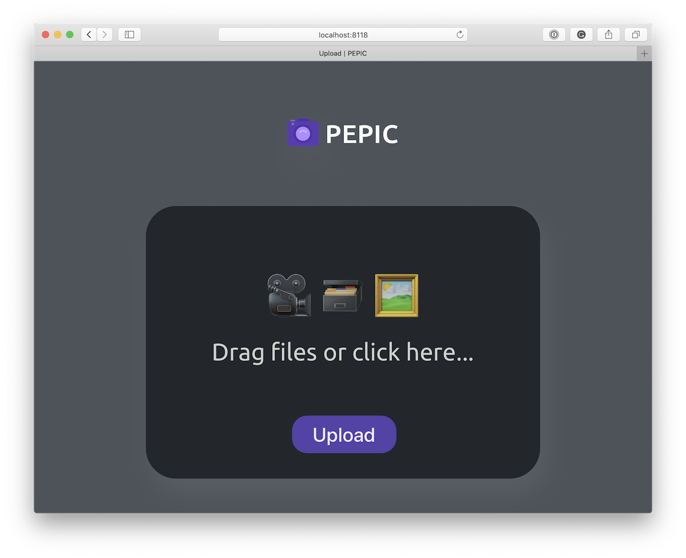

<div align="center">
  <br>
  
  <h1>PEPIC</h1>
</div>

Pepic is a small app that helps me to upload, store, convert and serve pictures or videos on your server.

I use it as media proxy for my [pet-projects](https://github.com/vas3k/vas3k.club) and on [my blog](https://vas3k.com). 
Pepic can convert, resize and optimize media files in-flight to save you monies and bandwidth. 
Internally it uses [ffmpeg](https://ffmpeg.org/download.html) for videos and [vips](https://libvips.github.io/libvips/install.html) for images,
which means it's quite fast and supports **JPG, PNG, GIF, WEBP, SVG, HEIF, TIFF** and wide range of video formats.  

It's not meant to be used by anyone else except me. Use it only if you're brave. Scroll down this README for better alternatives.

## 🤖 How to run it locally

This command starts a local server on [localhost:8118](http://localhost:8118). Useful for development.

```
go run main.go serve --config ./etc/pepic/config.yml
```

> ⚠️ If you're getting `invalid flag in pkg-config` error, run `export CGO_CFLAGS_ALLOW="-Xpreprocessor"` in advance

## 🐳 Running in Docker

1. Get [Docker](https://www.docker.com/get-started)

2. Clone the repo

```
git clone git@github.com:vas3k/pepic.git
cd pepic
```

3. Build and run the app

```
docker build .
docker run -p 8118:8118 -v ${PWD}/uploads:/app/uploads $(docker build -q .)
```

4. Go to [http://localhost:8118](http://localhost:8118) and try uploading something. 
You should see uploaded images or videos in the data directory (`./uploads`) after that.

5. Try to resize an image by adding a number of pixels to its URL. For example: `https://localhost:8118/file.jpg -> https://localhost:8118/500/file.jpg`

6. Check out the [etc/pepic/config.yml](etc/pepic/config.yml) file. Some stuff is turned off by default.
You can tweak them for yourself and rebuild the docker again (step 3) to apply them.



## 🚢 Production Usage

> ⚠️ If you plan to host anything bigger than a blog, always put it behind CDN. 
> CloudFlare offers a free one if you don't hate big corporations :D

Let's say, you want to host it on `https://media.mydomain.org`

#### 1. Modify `config/config.yml` to your taste

```
global:
  host: 0.0.0.0 
  port: 8118  # internal host and port, leave it as it is
  base_url: "https://media.mydomain.org"
  secret_code: "secretpass"
  max_upload_size: "500M"
```

#### 2. Build and run production docker

Don't forget to mount upload volume to store files on host (or you can lose those files when container will be killed).

```
docker run -p 8118:8118 -v /host/dir/uploads:/app/uploads $(docker build -q .)
```

If you prefer docker-compose, you can use it too. Check out the included [docker-compose.example.yml](docker-compose.example.yml). 
You can easily transform it into your favourite k8s config or whatever is fashionable this summer. 

> 👍 Don't forger to periodically backup the `/host/dir/uploads` directory just in case :)

#### 3. Use nginx or your other favourite proxy

Just proxy all calls from the domain (media.mydomain.org) to pepic backend (0.0.0.0:8118). It can handle static files too.

```
server {
    listen 80;
    server_name media.mydomain.org;

    location / {
        proxy_set_header X-Forwarded-For $proxy_add_x_forwarded_for;
        proxy_set_header Host $http_host;
        proxy_pass http://0.0.0.0:8118;
    }
}
```

## 😍 Contributions

Contributions are welcome.  

Open an [Issue](https://github.com/vas3k/vas3k.club/issues) if you want to report a bug and propose an idea.

## ✅ TODO

- [ ] Tests :D
- [ ] Upload by URL
- [ ] Crop, rotate and other useful transformations (face blur? pre-loader generator?)
- [ ] Live conversion by changing file's extension 
- [ ] Set format and quality during the upload (using GET/POST params?)

## 🤔 Alternatives

After reading all this, you probably realized how bad it is and looking for other alternatives. Here's my recommendations:

- [imgproxy](https://github.com/imgproxy/imgproxy)
- [imaginary](https://github.com/h2non/imaginary)
- [flyimg](https://github.com/flyimg/flyimg)

## 👩‍💼 License 

It's [MIT](LICENSE).

Contact me if you have any questions — [me@vas3k.ru](mailto:me@vas3k.ru).

❤️
